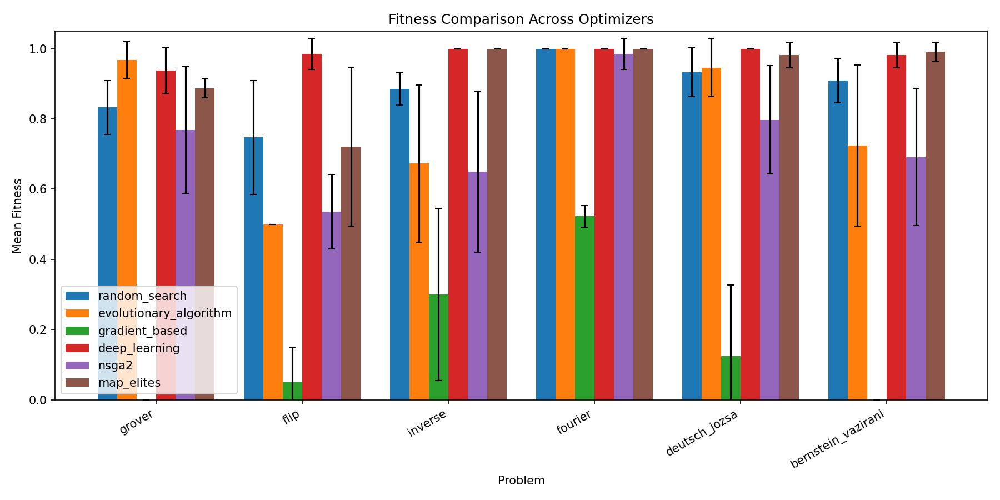
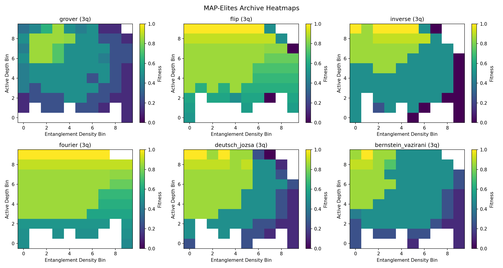
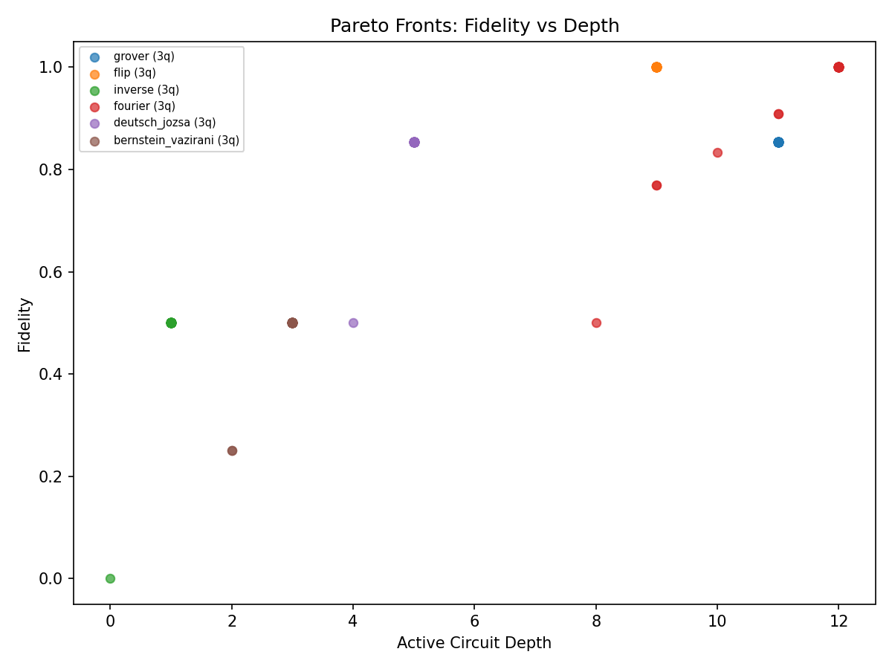

## The problem

Most approaches to quantum circuit optimisation ask: *what is the best circuit for this problem?* They search for a single solution that maximises fidelity.

But in practice, you often want more than one answer. Different quantum hardware has different constraints. A circuit that's optimal on a superconducting chip might be terrible on a trapped-ion device. A shallow circuit might be preferred for noisy hardware, even if a deeper one achieves slightly higher fidelity.

**Quality-diversity optimisation** flips the question: instead of finding *one* best circuit, can we discover a *diverse archive* of high-quality circuits that differ in meaningful structural ways?

## The approach

I benchmarked **six fundamentally different optimisation methods** across **six quantum problems** (Grover's search, Flip, Inverse, Fourier, Deutsch--Jozsa, Bernstein--Vazirani):

| Method | Type | What it optimises |
|--------|------|-------------------|
| **Evolutionary Algorithm** | Single-objective | Fidelity only |
| **Random Search** | Baseline | Nothing (uniform sampling) |
| **Gradient-Based** | Single-objective | Continuous relaxation of fidelity |
| **REINFORCE** | Single-objective | Policy gradient on fidelity |
| **NSGA-II** | Multi-objective | Fidelity, depth, and gate count jointly |
| **MAP-Elites** | Quality-diversity | Fidelity across a grid of (depth, entanglement) |

All methods share the same evaluation budget (10,000 circuit evaluations) and the same circuit representation: an integer matrix where each cell encodes one of five gate types (Identity, T, Hadamard, CNOT-down, CNOT-up).

The key enabler is a **pure numpy statevector simulator** I built that evaluates circuits in ~microseconds -- 100 to 1000 times faster than Qiskit's Aer simulator. This makes it feasible to run 360 experiments (6 optimisers x 6 problems x 10 trials) on a single machine.

## Results: who wins?



| Problem | RS | EA | Gradient | DL | NSGA-II | MAP-Elites |
|---------|:--:|:--:|:--------:|:--:|:-------:|:----------:|
| Grover | 0.83 | **0.97** | 0.00 | 0.94 | 0.77 | 0.89 |
| Flip | 0.75 | 0.50 | 0.05 | **0.99** | 0.54 | 0.72 |
| Inverse | 0.88 | 0.67 | 0.30 | **1.00** | 0.65 | **1.00** |
| Fourier | **1.00** | **1.00** | 0.52 | **1.00** | 0.99 | **1.00** |
| Deutsch-Jozsa | 0.93 | 0.95 | 0.13 | **1.00** | 0.80 | 0.98 |
| Bernstein-Vazirani | 0.91 | 0.72 | 0.00 | 0.98 | 0.69 | **0.99** |

**REINFORCE (deep learning)** achieves the highest single-objective fitness on most problems. But that's only part of the story.

## The interesting finding: MAP-Elites discovers circuit families

MAP-Elites doesn't just find one good circuit -- it fills a 2D archive indexed by **active circuit depth** (how many time steps have non-trivial gates) and **entanglement density** (what fraction of gates are CNOTs).



The heatmaps show that for each problem, there are high-fitness circuits across a wide range of structural configurations. MAP-Elites achieves **79--87% archive coverage** -- meaning it discovers viable circuits in the vast majority of the structural space.

This matters because:

1. **Different hardware, different needs.** A circuit with low entanglement density might run better on hardware where two-qubit gates are noisy. A shallow circuit might be preferred for devices with short coherence times.

2. **Understanding the problem.** Seeing *which* structural regions produce high-fitness circuits reveals something about the problem itself. For Fourier, high-fitness circuits exist everywhere. For Grover, they're concentrated in specific depth/entanglement regions.

3. **Robustness.** Having a diverse portfolio of solutions means you're not reliant on a single fragile optimum.

## NSGA-II: the compactness trade-off

NSGA-II optimises three objectives simultaneously: maximise fidelity, minimise circuit depth, minimise gate count. The result is a set of Pareto-optimal circuits that represent the best possible trade-offs.



The Pareto fronts reveal that NSGA-II produces dramatically more compact circuits (2.6--11.1 non-identity gates vs 14--22 for other methods). The trade-off is clear: you can get near-perfect fidelity *or* minimal gates, but the Pareto front shows exactly where the knee is.

## What didn't work: gradient-based optimisation

The gradient-based approach -- which relaxes the discrete gate choices into continuous softmax weights and optimises with L-BFGS-B -- consistently fails. On Grover and Bernstein-Vazirani, it achieves near-zero fitness.

The problem is fundamental: the final circuit must use *discrete* gates, but gradient optimisation works in a *continuous* space. The discretisation step (argmax over the softmax weights) destroys the gradient information that made the continuous solution good. This "discretisation gap" is a known challenge, and these results provide empirical evidence for how severe it is.

## Five takeaways

1. **Quality-diversity methods work for quantum circuits.** MAP-Elites discovers diverse, high-quality circuit archives and is competitive with single-objective methods on raw fitness. This is, to my knowledge, among the first demonstrations of MAP-Elites for quantum circuit synthesis.

2. **Multi-objective search reveals useful trade-offs.** NSGA-II's Pareto fronts give practitioners a menu of circuits to choose from, rather than a single take-it-or-leave-it answer.

3. **Deep learning is the fidelity champion** -- but at the cost of circuit diversity and interpretability.

4. **Gradient-based optimisation is the wrong tool** for discrete circuit synthesis. The discretisation gap is real and severe.

5. **Fast simulation is the key enabler.** A 100--1000x speedup over Qiskit makes it practical to run hundreds of trials and fill quality-diversity archives. The entire 360-experiment study runs in minutes on a laptop.

## Code and paper

Everything is open source:

- **Code**: [github.com/llens/QuantumComputingEvolutionaryAlgorithmDesign](https://github.com/llens/QuantumComputingEvolutionaryAlgorithmDesign)
- **Paper**: [PDF](https://github.com/llens/QuantumComputingEvolutionaryAlgorithmDesign/blob/master/paper/paper.pdf)
- **Literature Review**: [PDF](https://github.com/llens/QuantumComputingEvolutionaryAlgorithmDesign/blob/master/literature_review/literature_review.pdf) (35+ papers surveyed)

To reproduce the results:

```bash
git clone https://github.com/llens/QuantumComputingEvolutionaryAlgorithmDesign.git
cd QuantumComputingEvolutionaryAlgorithmDesign
python -m venv venv && source venv/bin/activate
pip install -r requirements.txt -r requirements-study.txt
python -m examples.run_qd_study
```

If you use this work in a publication, please cite it (see [CITATION.cff](https://github.com/llens/QuantumComputingEvolutionaryAlgorithmDesign/blob/master/CITATION.cff)).
